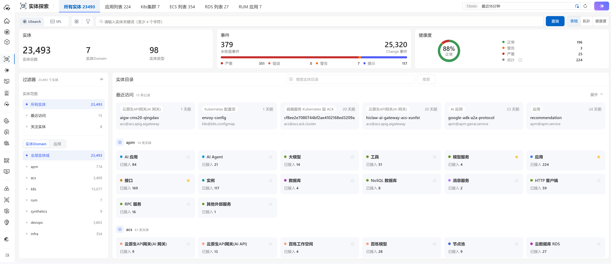
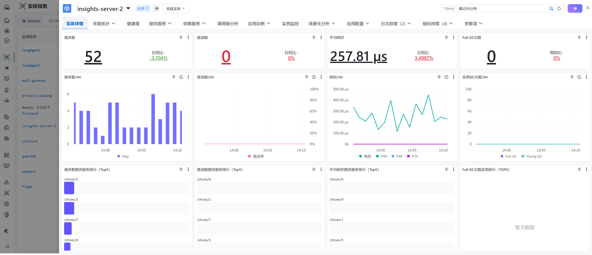
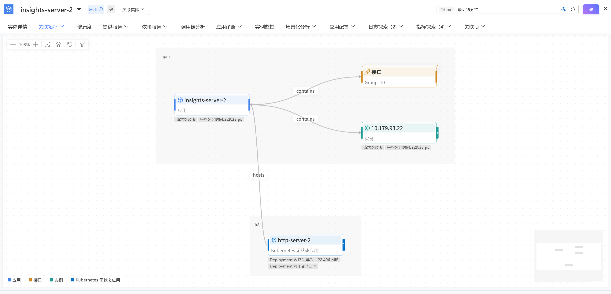
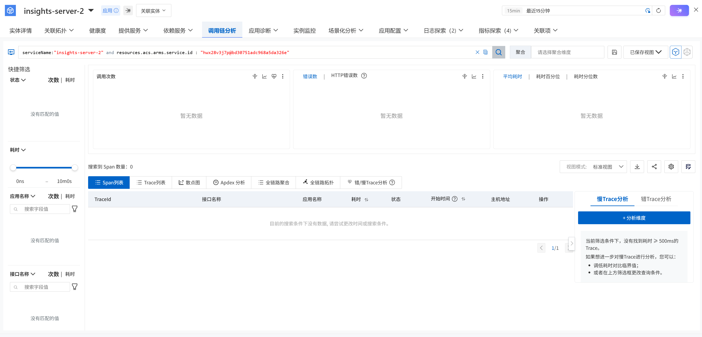
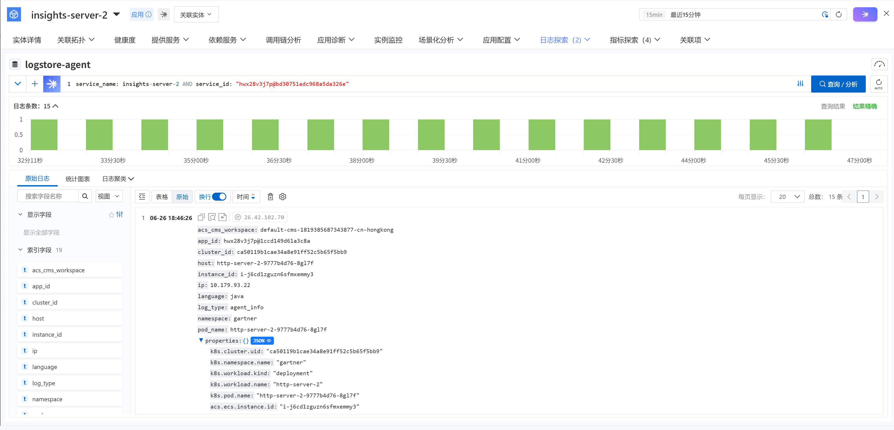
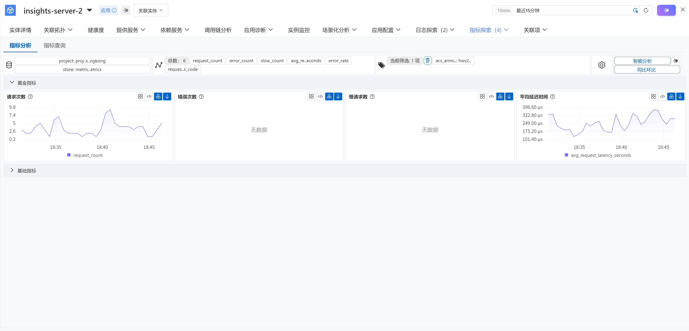
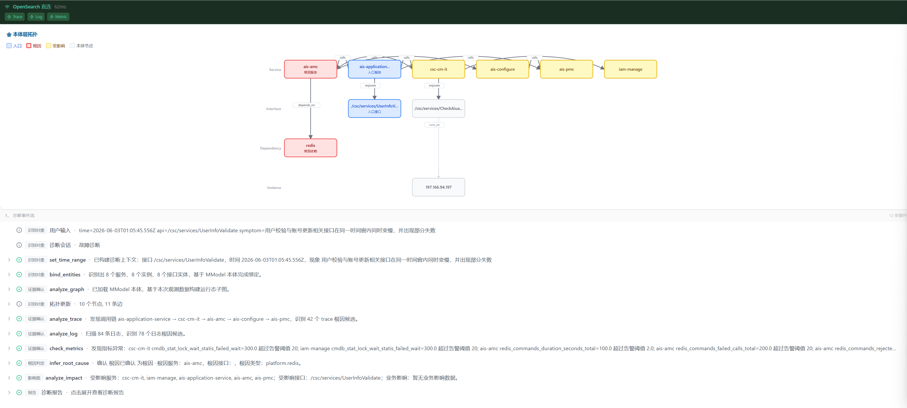
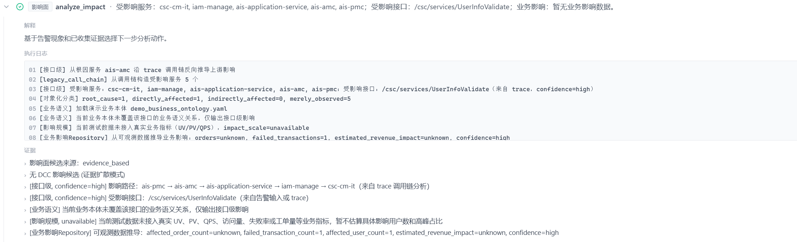
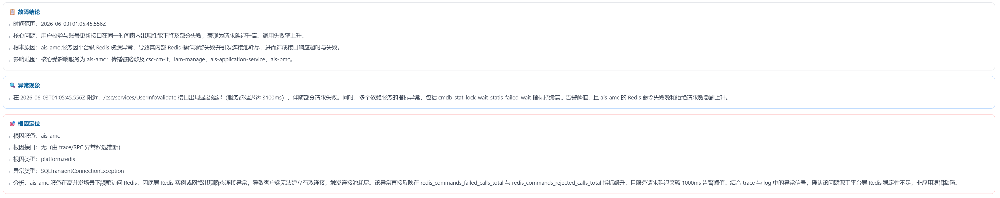
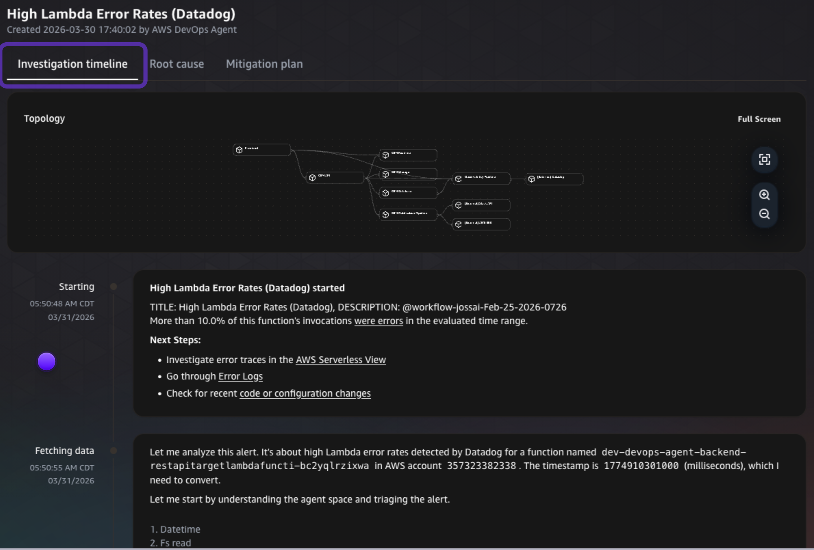

# MModel 参考截图说明

## 文档定位

本文件用于向外协团队提供 MModel 目标体验的视觉参考，帮助其理解关键页面承载的信息结构、调查路径和交互重点。

参考截图可来自阿里云 UModel、AWS DevOps Agent 或其他已有产品，但仅作为能力表达参考，不作为 MModel 最终产品定义。

在当前这版文档中，建议明确以下边界：

- 截图仅用于辅助理解，不代表 MModel 最终 UI 设计稿。
- 截图表达的是能力结构与交互方向，不代表品牌风格、菜单命名或平台归属。
- 任何平台特有字段、产品术语、导航结构或操作逻辑，均不应直接继承为 MModel 产品需求。
- 最终需求范围、能力边界和页面职责以 [prd.md](prd.md) 与 [ui.md](ui.md) 为准。

## 素材清单

当前参考截图统一存放于：

`docs/docs/assets/`

已纳入交付范围的素材如下：

- `01-object-map.png`：对象地图
- `02-entity-detail.png`：实体探索概览
- `03-topology.png`：拓扑浏览
- `04a-trace-evidence.png`：Trace 证据视图
- `04b-log-evidence.png`：Log 证据视图
- `04c-metric-evidence.png`：Metric 证据视图
- `05-diagnosis.png`：结构化诊断结果
- `06-impact-analysis.png`：影响面分析
- `07-investigation-report.png`：调查报告
- `08-investigation-timeline.png`：调查时间线

## 使用原则

- 外协应优先理解截图所表达的页面职责、信息组织方式和调查主路径，而不是复刻现有产品外观。
- 同一能力在 MModel 中可以采用不同的页面布局或交互方式，只要满足 PRD 中定义的目标即可。
- 在当前方案设想中，证据、拓扑、诊断、影响面、报告等能力更适合服务于 MModel 自身的产品能力表达，而不是完全依附于某个宿主平台实现业务闭环。
- 若参考截图与正式需求文档存在差异，应以正式需求文档为准。

## 页面对应关系

### 1. 对象地图参考

来源：阿里云 UModel 截图
参考目的：帮助理解对象地图如何作为调查入口组织对象类型、对象分组和问题聚焦路径
对应 MModel 能力：Web UI / Entity Management / Topology
保留重点：对象入口层级、对象分类方式、从概览进入调查的主路径
不直接继承：品牌样式、宿主平台导航、平台专属菜单结构

### 2. 实体探索概览参考

来源：阿里云 UModel 截图
参考目的：帮助理解实体探索概览页如何组织对象身份、状态、属性和核心调查入口
对应 MModel 能力：Entity Management / Health / Evidence
保留重点：对象摘要区、标签属性区、健康摘要区、进入拓扑与证据的入口
不直接继承：平台特有字段命名、平台专属状态体系

### 3. 拓扑浏览参考

来源：阿里云 UModel 截图
参考目的：帮助理解如何从一个对象出发查看上下游依赖、关系方向和影响路径
对应 MModel 能力：Topology / Relation / Historical Runtime
保留重点：中心对象视角、上下游方向表达、对象关系浏览方式
不直接继承：平台专用拓扑术语、宿主平台绑定的交互控件

### 4. Trace 证据视图参考

来源：阿里云 UModel 截图
参考目的：帮助理解对象证据页中的调用链分析子视图如何组织 Trace、Span、接口维度和链路异常线索
对应 MModel 能力：Evidence / Trace / Query API
保留重点：对象上下文保持、时间范围联动、链路异常切入方式
不直接继承：底层平台专有查询语法、供应商专用术语

### 5. Log 证据视图参考

来源：阿里云 UModel 截图
参考目的：帮助理解对象证据页中的日志子视图如何展示与对象相关的日志片段、异常日志和筛选条件
对应 MModel 能力：Evidence / Logs / Query API
保留重点：对象相关日志聚合方式、时间范围联动、异常日志定位入口
不直接继承：底层索引命名、平台私有字段名称、与日志平台深度绑定的操作方式

### 6. Metric 证据视图参考

来源：阿里云 UModel 截图
参考目的：帮助理解对象证据页中的指标子视图如何展示核心指标、异常波动和时间趋势
对应 MModel 能力：Evidence / Metrics / Query API
保留重点：对象指标摘要、趋势呈现方式、异常指标识别入口
不直接继承：平台特定图表组件、特定监控产品命名方式

### 7. 结构化诊断结果参考

来源：项目现有 Demo 截图
参考目的：帮助理解结构化诊断页如何呈现上下文摘要、疑似根因、证据引用和建议动作
对应 MModel 能力：Diagnosis API / Web UI
保留重点：诊断结果结构、证据引用方式、建议动作输出格式
不直接继承：模型品牌表达、特定 Copilot 会话样式

### 8. 影响面分析参考

来源：项目现有 Demo 截图
参考目的：帮助理解如何展示故障传播范围、受影响对象和优先级判断依据
对应 MModel 能力：Topology / Relation / Diagnosis
保留重点：受影响对象列表、传播路径摘要、优先级表达
不直接继承：特定业务域术语、宿主平台专用操作入口

### 9. 调查报告参考

来源：项目现有 Demo 截图
参考目的：帮助理解调查结果如何沉淀为可复用、可导出的结构化报告
对应 MModel 能力：Diagnosis / Report
保留重点：事件摘要、根因结论、证据清单、影响范围、建议动作
不直接继承：组织内部固定审批流、平台专属导出样式

### 10. 调查时间线参考

来源：AWS DevOps Agent
参考目的：帮助理解如何以对象为中心统一展示 Metrics、Logs、Traces、Events、Topology Changes 和 Diagnosis Steps
对应 MModel 能力：Investigation Timeline / Evidence / Topology / Diagnosis
保留重点：时间轴组织方式、关键时刻高亮、事件与证据或拓扑的联动关系
不直接继承：特定产品品牌风格、供应商术语、与某一助手强绑定的页面框架
