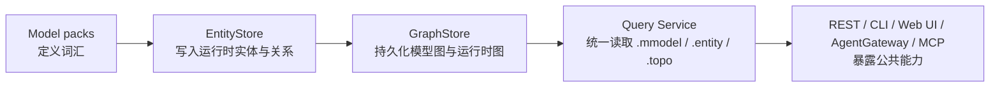

# MModel 学习导览

这组文档面向第一次系统理解 MModel 的读者。目标不是覆盖每一行代码，而是先建立稳定的心智模型，再把你带到最关键的源码入口、调用链和验证命令上。

## 这组文档回答什么

- MModel 想解决什么问题。
- 运行时对象图由哪些概念组成。
- 服务、存储、查询、Agent 和 Web UI 如何连起来。
- 一次模型导入、实体写入、查询执行分别经过哪些包。
- 阅读源码时先看哪里，后看哪里。

## 建议阅读顺序

1. [项目地图与阅读路线](README.md)
2. [核心概念](core-concepts.md)
3. [系统架构](architecture.md)
4. [模型导入与运行时写入](model-and-write-flow.md)
5. [查询执行链路](query-flow.md)
6. [AgentGateway 与 MCP](agent-and-mcp.md)
7. [源码导航](source-navigation.md)
8. [实践学习路径](learning-path.md)

## 阅读方式

- 先读文档中的“你需要记住什么”，建立总体印象。
- 再按“关键源码入口”打开对应文件。
- 最后运行文档里的命令，把抽象概念和真实行为对上。

## 先记住这五层



如果你先把这五层记住，后面的代码就不容易看散。

## 最小验证命令

```bash
make quickstart
go run ./cmd/mmctl --addr http://localhost:8080 query run demo ".mmodel | limit 5"
go run ./cmd/mmctl --addr http://localhost:8080 query run demo ".entity | limit 5"
go run ./cmd/mmctl --addr http://localhost:8080 query run demo ".topo | limit 5"
```

## 配套参考

- [项目 README](../../../README_CN.md)
- [快速开始](../getting-started/quickstart.md)
- [架构总览](../architecture/overview.md)
- [Query Service 指南](../guides/query-service.md)
- [MCP 参考](../reference/mcp.md)
