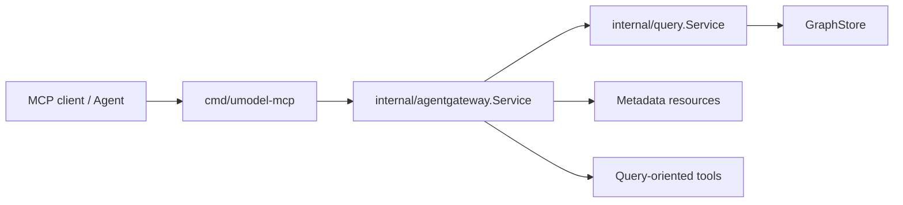

# AgentGateway 与 MCP

这篇帮助你回答两个常见问题：

- AgentGateway 和 Query Service 是什么关系。
- `umodel-mcp` 到底是在暴露什么。

## 先记一句话

AgentGateway 是 Query Service 的 agent-facing 适配层，`umodel-mcp` 是把这层能力用 MCP 协议暴露出去。

## 关系图



## AgentGateway 负责什么

关键文件：

- `internal/agentgateway/service.go`

主要职责：

- `Discover`：返回 tools、resources、next actions
- `Tools`：返回工具列表
- `ReadResource`：读取元数据资源
- `ExecuteTool`：执行查询工具或明确启用的写工具

最关键的设计点：

- 默认读优先
- 资源偏元数据
- 运行时行数据通过工具返回
- 写工具默认关闭

## 默认工具集合

从 `defaultTools()` 可以看到当前主工具包括：

- `query_spl_execute`
- `query_spl_explain`
- `query_spl_examples`
- `umodel_validate`
- `umodel_import`
- `entity_write`
- `entity_expire`

其中后面三个和写入有关，需要显式开启。

## 为什么资源不直接返回运行时行数据

这是一个刻意的安全和边界设计：

- 资源适合暴露静态元数据、模板、能力说明。
- 运行时行数据通常更大、更动态，也更需要受控查询。
- 让查询工具复用 Query Service，可以保持读取行为一致。

所以你会看到资源像：

- `overview`
- `schema-index`
- `query-templates`
- `tool-capability-metadata`

## MCP 进程入口

关键文件：

- `cmd/umodel-mcp/main.go`

这个入口做的事情和 `umodel-server` 很像：

- 解析 flags
- 组装 App
- 可选 quickstart
- 选择 stdio 或 HTTP transport

你可以把它看成“面向 MCP 客户端的另一种进程包装”，而不是另一套业务实现。

## MCP 支持的传输方式

根据当前实现和文档：

- `stdio`
- Streamable HTTP
- 兼容 HTTP+SSE

常见本地启动命令：

```bash
go run ./cmd/umodel-mcp --data data --graphstore memory
```

HTTP 模式：

```bash
go run ./cmd/umodel-mcp --transport http --addr 127.0.0.1:8090 --data data --graphstore file.memory
```

## MCP 为什么仍然不绕过 Query Service

因为项目不希望 Agent 层长出第二套读取语义。

这会带来几个好处：

- CLI、Web UI、REST、MCP 的查询语义保持一致
- explain 结果和 provider 能力判断保持一致
- 测试入口更集中

## 推荐源码阅读顺序

1. `internal/agentgateway/service.go`
2. `cmd/umodel-mcp/main.go`
3. `cmd/umodel-mcp/http.go`
4. `docs/zh/reference/mcp.md`

## 推荐验证命令

```bash
go run ./cmd/umctl --addr http://localhost:8080 agent discover demo
go run ./cmd/umctl --addr http://localhost:8080 agent tool demo query_spl_examples '{}'
go run ./cmd/umctl --addr http://localhost:8080 agent tool demo query_spl_explain '{"query":".umodel | limit 5"}'
```

本地 MCP 冒烟测试可参考：

- `docs/zh/reference/mcp.md`
- `examples/mcp/README.zh-CN.md`

## 配套参考

- [MCP 参考](../reference/mcp.md)
- [Query 与 Agent 架构](../architecture/query-and-agent.md)
- [MCP 示例](../../../examples/mcp/README.zh-CN.md)
