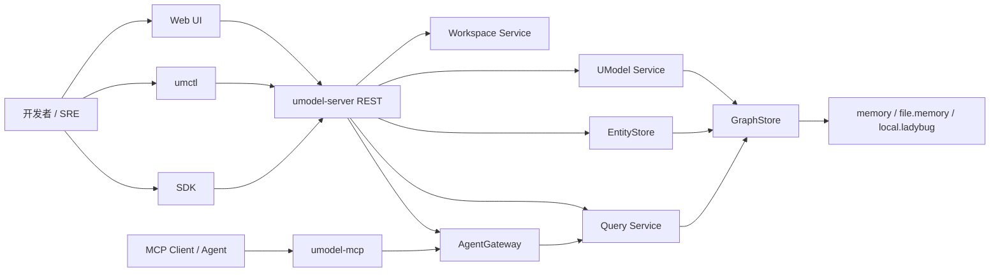
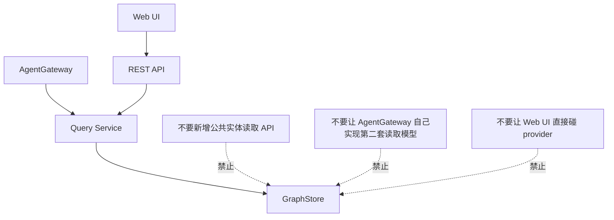

# 系统架构

这一篇只关心一件事：代码是如何分层的，以及什么边界是项目明确要守住的。

## 总体结构

## 分层阅读法

### 1. 进程入口层

关注“程序怎么启动”。

关键文件：

- `cmd/umodel-server/main.go`
- `cmd/umodel-mcp/main.go`

你会看到：

- flag 解析
- GraphStore provider 选择
- quickstart 特殊逻辑
- 把请求交给 `internal/bootstrap`

### 2. 组装层

关注“服务怎么被连起来”。

关键文件：

- `internal/bootstrap/app.go`
- `internal/bootstrap/quickstart.go`

这里是最值得先读的文件之一，因为它告诉你整个系统的 wiring：

- `workspace.NewService`
- `graphstore.NewProvider`
- `umodel.NewService`
- `entitystore.NewService`
- `query.NewServiceWithProviders`
- `agentgateway.NewService`

如果你只想快速知道“有哪些核心服务，以及它们之间怎么连”，先看这里。

### 3. 应用服务层

关注“每个服务真正负责什么”。

关键包：

- `internal/workspace`
- `internal/umodel`
- `internal/entitystore`
- `internal/query`
- `internal/agentgateway`

推荐读法：

- 先读 `service.go`
- 再读对应 `*_test.go`

### 4. 存储抽象层

关注“上层依赖什么接口，而不是依赖哪种实现”。

关键位置：

- `pkg/contract/contracts.go`
- `internal/graphstore`

最重要的接口是 `GraphStore`，因为模型写入、实体写入、查询执行最终都要落到这里。

## 项目明确要守的边界

仓库文档和 guard 共同强调这些边界：

- Workspace Service 只管 workspace 元数据。
- UModel Service 只管模型校验、导入、写入、索引。
- EntityStore 只管运行时实体和关系写入、过期。
- Query Service 是唯一公共读路径。
- AgentGateway 的资源偏元数据，运行时行数据通过工具返回。
- Web UI 只能调用公共 REST API。

## 为什么这个分层值得记

它直接决定你以后读代码时的提问方式：

- “这是写路径还是读路径？”
- “这是公共契约还是内部实现？”
- “这个改动会不会越过 Query Service 边界？”
- “这个功能应该放在 AgentGateway 还是 Query Service？”

问题问对了，很多实现细节就不再乱。

## 最小源码导航

如果只给你 20 分钟：

1. 读 `cmd/umodel-server/main.go`
2. 读 `internal/bootstrap/app.go`
3. 读 `pkg/contract/contracts.go`
4. 读 `internal/query/service.go`
5. 读 `internal/agentgateway/service.go`

这五步足够建立架构主线。

## 配套参考

- [架构总览](../architecture/overview.md)
- [运行时流程](../architecture/runtime-flow.md)
- [Query 与 Agent 架构](../architecture/query-and-agent.md)
- [GraphStore Providers](../graphstore-providers.md)
