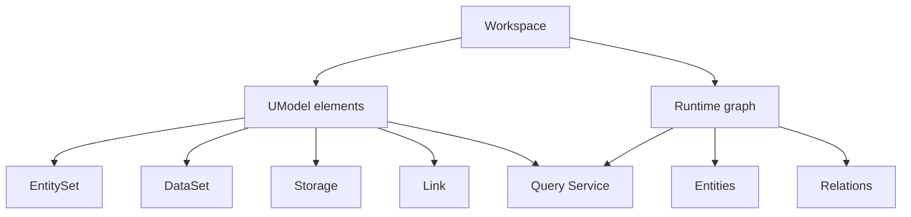

# 核心概念

理解 UnifiedModel，先别急着看控制器和路由。先把“它把什么建模成什么”想清楚。

## 你需要记住什么

- `workspace` 是最外层隔离单元。
- `UModel` 元素定义对象图词汇，而不是运行时数据本身。
- `entity` 和 `relation` 是运行时对象图数据。
- `GraphStore` 负责存和读，但不直接成为公共读接口。
- `Query Service` 是唯一公共读取入口。

## 概念关系

## Workspace

`workspace` 是本地语义上下文的边界。模型定义、实体、关系、查询和 Agent 发现都必须带 workspace。

关键源码：

- `internal/workspace/service.go`
- `pkg/contract/contracts.go` 中的 `WorkspaceManager`

重点看什么：

- `CreateWorkspace` 如何创建元数据。
- `ListWorkspaces` 如何做分页和过滤。
- `file.memory` 场景下 `workspaces.json` 如何持久化。

## UModel 元素

UModel 元素是“词汇层”，定义有哪些对象类型、数据集、链接和存储语义。

最重要的几类：

- `entity_set`：定义某一类对象，比如服务、实例、仓库、环境。
- `data_set`：定义指标、日志、链路、事件、Profile、Runbook 等数据集。
- `storage`：描述数据存放位置。
- `link`：连接实体、数据集和存储。

关键源码：

- `internal/umodel/service.go`
- `internal/umodel/schemaspec/`
- `pkg/model/types.go`

重点看什么：

- `Validate` 如何做 schema 驱动校验。
- `PutElements` 如何在写入前执行校验。
- `ResolveEntitySet` 和 `ResolveRelationType` 如何为运行时写入提供 schema 支撑。

## 运行时实体与关系

运行时数据不是 YAML，而是 CMS 2.0 兼容的 payload。

- `entity` 表示某个具体对象实例。
- `relation` 表示两个对象之间的具体关系。

关键源码：

- `internal/entitystore/service.go`
- `examples/quickstart-multidomain/sample-data/entities.json`
- `examples/quickstart-multidomain/sample-data/relations.json`

重点看什么：

- 必填字段校验，如 `__entity_id__`、`__method__`。
- `IdempotencyKey` 如何避免重复写入。
- `ExpireEntities` 和 `ExpireRelations` 如何把过期操作转换为写入。

## GraphStore

GraphStore 是存储抽象层，不是业务入口层。它提供 provider-neutral 的读写契约，背后可以接不同 provider。

关键源码：

- `pkg/contract/contracts.go` 中的 `GraphStore`
- `internal/graphstore/`

当前默认 provider：

- `memory`
- `file.memory`
- `local.ladybug`

## Query Service

UnifiedModel 的一个核心设计是：公共读取只走 Query Service。

公共查询源只有三个：

- `.umodel`
- `.entity`
- `.topo`

关键源码：

- `internal/query/service.go`
- `internal/query/planner.go`
- `internal/query/executor.go`

这意味着：

- Web UI 读模型和读实体都不应绕过 Query Service。
- AgentGateway 的运行时行数据也应由 Query Service 工具返回。
- 不应该再额外发明一套“实体查询 API”作为公共接口。

## AgentGateway

AgentGateway 不是第二套数据访问层，而是 Query Service 的 agent-facing 适配层。

它负责：

- 工具发现
- 资源发现
- 示例查询
- 工具执行

它不负责：

- 重新定义查询语言
- 直接暴露运行时实体行作为资源

关键源码：

- `internal/agentgateway/service.go`

## 一句话心智模型

可以把 UnifiedModel 理解为：

“用模型定义对象图词汇，用实体和关系填充运行时图，再通过统一查询面把这张图安全地暴露给人类界面、CLI 和 Agent。”

## 配套参考

- [对象图语义层](../concepts/object-graph-semantic-layer.md)
- [Model Elements](../concepts/model-elements.md)
- [Entity 与 Relation](../concepts/entities-and-relations.md)
- [查询入口](../concepts/query-surfaces.md)
