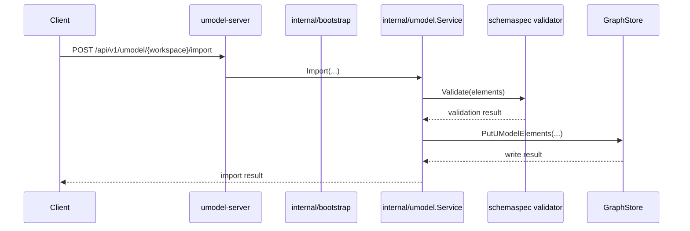
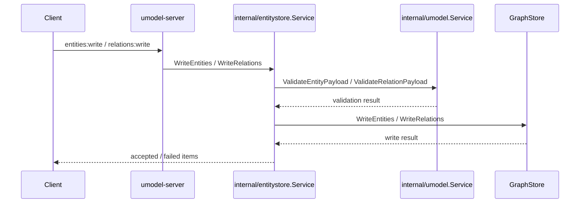

# 模型导入与运行时写入

这篇把“数据如何进入 UnifiedModel”讲清楚。写路径主要分成两类：模型写入和运行时写入。

## 模型导入链路



## 运行时实体与关系写入链路



## 1. 模型导入入口

路由入口在：

- `internal/bootstrap/app.go` 的 `handleUModel`

核心动作：

- `/import`：导入一整个模型路径
- `/validate`：校验元素但不写入
- `/elements`：直接写元素

服务实现：

- `internal/umodel/service.go`

先看这几个函数：

- `Validate`
- `PutElements`
- `RebuildIndex`

## 2. UModel Service 在写路径中的角色

UModel Service 做三件事：

1. 校验元素是否满足 schema。
2. 把合法元素写入 GraphStore。
3. 维护内存中的 schema 索引，供运行时写入时解析实体类型和关系类型。

阅读提示：

- `Validate` 是 schema 驱动入口。
- `PutElements` 调用了 `Validate` 和 `graph.PutUModelElements`。
- `ResolveEntitySet` 与 `ResolveRelationType` 说明它也承担了“schema resolver”的角色。

## 3. EntityStore 在写路径中的角色

EntityStore 是运行时写入服务，不直接公开读取能力。

关键文件：

- `internal/entitystore/service.go`

重点看这些行为：

- `WriteEntities`
- `WriteRelations`
- `ExpireEntities`
- `ExpireRelations`

你会看到：

- 写入前先调用 resolver 校验 payload。
- `PartialSuccess` 决定是否允许部分失败。
- `IdempotencyKey` 会缓存结果，避免重复写入。
- 过期操作不是单独的删除接口，而是转换成带 `Expire` 方法的写入 payload。

## 4. Quickstart 样例如何进入系统

如果你想看最完整、最可复现的一条写路径，最推荐看 quickstart。

关键文件：

- `internal/bootstrap/quickstart.go`
- `internal/sampledata/service.go`
- `examples/quickstart-multidomain/README.md`

执行流程：

1. `LoadQuickStart` 确保 `demo` workspace 存在。
2. `Samples.Import` 解析样例名。
3. `umodel.Import` 导入样例模型。
4. `entityStore.WriteEntities` 写入实体 JSON。
5. `entityStore.WriteRelations` 写入关系 JSON。

这个路径特别适合第一次调试，因为它把模型和运行时图都一次性铺好。

## 5. 你实际会修改哪里

如果你在做不同类型的改动，可以先定位到这里：

- 调整模型元素校验：`internal/umodel` 和 `internal/umodel/schemaspec`
- 调整运行时 payload 校验：`internal/umodel/service.go`
- 调整写入批处理逻辑：`internal/entitystore/service.go`
- 调整样例导入：`internal/sampledata/service.go`
- 调整 HTTP 写接口：`internal/bootstrap/app.go`

## 6. 写路径的边界提醒

- 不要在写接口中偷偷增加新的公共读能力。
- 不要让 Web UI 绕过 REST 直接接触内部服务。
- 不要让 AgentGateway 成为另一条模型写入主路径，除非明确启用写工具。

## 推荐验证命令

```bash
make quickstart
go run ./cmd/umctl --addr http://localhost:8080 query run demo ".umodel | limit 5"
go run ./cmd/umctl --addr http://localhost:8080 query run demo ".entity | limit 5"
go run ./cmd/umctl --addr http://localhost:8080 query run demo ".topo | limit 5"
```

如果你修改了 quickstart 样例：

```bash
make example-validate
make test-service
```

## 配套参考

- [快速开始](../getting-started/quickstart.md)
- [实体与关系写入指南](../guides/entity-relation-writes.md)
- [Multi-Domain Quickstart Example Pack](../../../examples/quickstart-multidomain/README.md)
