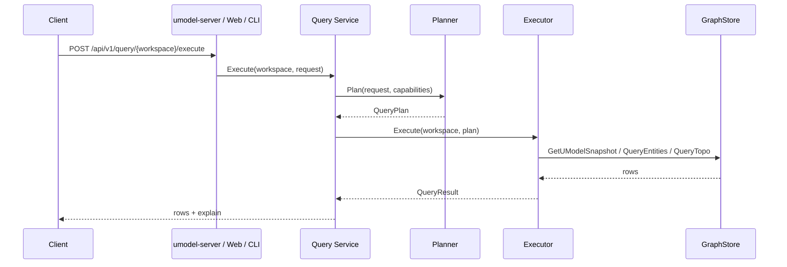

# 查询执行链路

如果说 UnifiedModel 有一条最值得反复记住的主线，那就是：公共读取统一走 Query Service。

## 三个公共查询源

- `.umodel`：读取模型定义
- `.entity`：读取运行时实体
- `.topo`：读取运行时拓扑关系

## 查询执行总链路



## 1. 路由入口

关键位置：

- `internal/bootstrap/app.go` 的 `handleQuery`

两个动作：

- `/execute`
- `/explain`

这说明 Query Service 从 HTTP 层面就已经被明确设定为统一读入口。

## 2. Query Service 做什么

关键文件：

- `internal/query/service.go`

它的职责很清晰：

- 向 GraphStore 询问 capabilities 和 health。
- 把请求交给 planner 生成 plan。
- 把 plan 交给 executor 执行。
- 组装 explain 信息返回给客户端。

建议先读：

- `Execute`
- `Explain`
- `plan`

## 3. Planner 做什么

关键文件：

- `internal/query/planner.go`
- `internal/query/parser.go`
- `internal/query/ast.go`

Planner 的作用不是直接查数据，而是把 SPL 转成受限、可验证的执行计划。

它会检查：

- `limit` 是否超过 provider 能力
- `topk` 是否超过能力
- `depth` 是否超过能力
- `.topo` 的 `graph-call` 是否在允许列表中
- provider 是否支持 controlled cypher

这一步很重要，因为它让 Query Service 成为“受控读入口”，而不是字符串直通执行器。

## 4. Executor 做什么

关键文件：

- `internal/query/executor.go`

Executor 会按查询源分发：

- `.umodel` -> `GetUModelSnapshot`
- `.entity` -> `QueryEntities`
- `.topo` -> `QueryTopo`

然后执行本地 pipeline 操作：

- `with`
- `where`
- `project`
- `sort`
- `limit`

你可以把它理解为：

“GraphStore 负责提供基础结果集，Executor 负责完成统一查询层的剩余加工。”

## 5. `.umodel`、`.entity`、`.topo` 的差异

### `.umodel`

读取模型快照，常用于：

- 查看有哪些 `entity_set`
- 浏览定义中的 domain、name、kind
- 支撑 Explorer 视图

### `.entity`

读取运行时实体，常用于：

- 搜索某一 domain / entity type 下的对象
- 查看对象属性
- 给 `.topo` 查询提供输入实体

### `.topo`

读取运行时关系和图遍历结果，常用于：

- 看直接关系
- 看邻居节点
- 执行受控 cypher

## 6. Explain 为什么值得常用

`explain` 是学习代码和调试查询时最好用的工具之一。

```bash
go run ./cmd/umctl --addr http://localhost:8080 query explain demo ".entity with(domain='devops', name='devops.service') | limit 5"
```

它能帮你确认：

- Query source
- Provider
- Storage provider
- 计划中的 operators
- 限制条件

当你怀疑“为什么这个查询结果不对”时，先看 explain，比先猜实现更省时间。

## 7. Web UI 和 Agent 为什么都要复用这条链

因为一旦所有客户端共用 Query Service：

- 行为更一致
- explain 更一致
- 测试更集中
- 不容易长出平行但不等价的读取语义

这也是仓库反复强调“不要新增公共实体读取 API”的原因。

## 推荐验证命令

```bash
go run ./cmd/umctl --addr http://localhost:8080 query run demo ".umodel with(kind='entity_set') | sort name | limit 10"
go run ./cmd/umctl --addr http://localhost:8080 query run demo ".entity with(domain='devops', name='devops.service', query='checkout') | limit 10"
go run ./cmd/umctl --addr http://localhost:8080 query run demo ".topo | graph-call getDirectRelations([(:\"devops@devops.service\" {__entity_id__: '10000000000000000000000000000101'})]) | limit 10"
go run ./cmd/umctl --addr http://localhost:8080 query explain demo ".topo | graph-call cypher(`MATCH (src)-[r]->(dest) RETURN src, r AS relation, dest LIMIT 5`)"
```

## 配套参考

- [Query Service 指南](../guides/query-service.md)
- [查询入口](../concepts/query-surfaces.md)
- [Query 与 Agent 架构](../architecture/query-and-agent.md)
